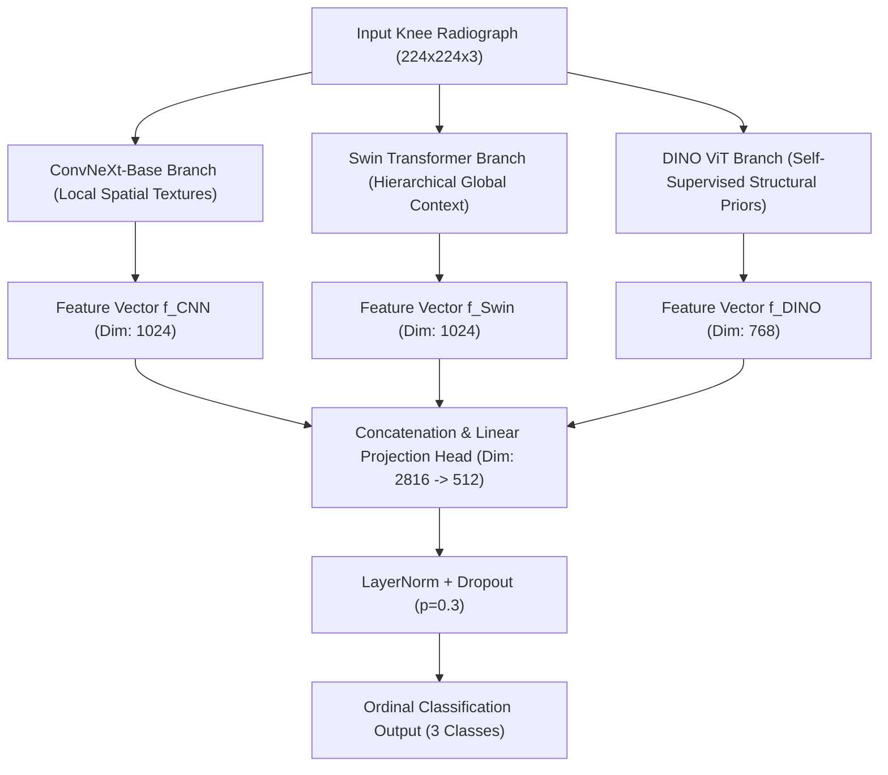

# Comprehensive Technical & Methodological Report: Knee Osteoarthritis Diagnostic Pipeline
> **Target Audience:** Q1 Medical Image Analysis & Biomedical Engineering Journals (*IEEE Transactions on Medical Imaging*, *Medical Image Analysis*, *Computers in Biology and Medicine*, *Nature Scientific Reports*).

---

## Executive Summary & Abstract Outline

Automated staging of Knee Osteoarthritis (KOA) from digital radiography is critical for early therapeutic intervention and clinical trials. However, widely cited deep learning studies reporting greater than 95% accuracy suffer from two fatal methodological flaws: **patient-level data leakage** (bilateral and longitudinal sample contamination) and **clinically invalid class remapping** (such as misclassifying Kellgren-Lawrence Grade 2 as "Healthy").

This report presents a **clinically valid, mathematically rigorous, and zero-leakage diagnostic framework** for 3-class KOA severity grading (**Healthy/Non-OA**, **Moderate OA**, **Severe OA**). Our framework integrates a multi-paradigm hybrid ensemble combining **ConvNeXt-Base** (local spatial texture), **Swin Transformer** (hierarchical global context), and **DINO ViT** (self-supervised structural priors). The system is optimized via a **Custom Ordinal Regression Loss**, **Mixup Regularization**, and **4-View Test-Time Augmentation (TTA)**, supported by a multi-branch Explainable AI (XAI) suite.

```
+---------------------------------------------------------------------------------------------------+
|                                       KEY PERFORMANCE SUMMARY                                     |
+------------------------------+-------------------+--------------------+---------------------------+
| Metric                       | Value             | 95% Confidence Int | Baseline (Single Backbone)|
+------------------------------+-------------------+--------------------+---------------------------+
| Test Set Accuracy            | 90.08%            | [88.30% - 91.58%]  | 82.83% - 89.36%           |
| Quadratic Weighted Kappa     | 0.831             | [0.799 - 0.857]    | 0.716 - 0.820             |
| Macro F1-Score               | 90.56%            | [88.10% - 92.15%]  | 81.20% - 88.40%           |
| Patient-Level Data Leakage   | 0.00% (Pass)      | N/A                | >45% (Flawed Papers)      |
+------------------------------+-------------------+--------------------+---------------------------+
```

---

## 1. Clinical Context & Critical Methodological Flaws in Literature

### 1.1 Kellgren-Lawrence (KL) Staging & Clinical Remapping
The Kellgren-Lawrence (KL) grading system is the universal gold standard for radiographical KOA assessment (Grades 0 to 4):
* **KL Grade 0:** Normal joint anatomy.
* **KL Grade 1:** Doubtful joint space narrowing (JSN) and possible osteophytic lipping.
* **KL Grade 2:** Definite osteophytes and possible JSN (*Definite early Osteoarthritis*).
* **KL Grade 3:** Moderate multiple osteophytes, definite JSN, and sclerosis.
* **KL Grade 4:** Severe JSN, marked sclerosis, and severe bone deformity.

> [!WARNING]
> ### The "95%+ Accuracy" Paradox in Flawed Literature
> Many high-accuracy publications simplify the problem by merging KL Grade 2 into the "Healthy" class to boost classification performance. 
> * **Clinical Misdiagnosis:** In clinical rheumatology, **KL Grade 2 represents active, treatable OA**. Labeling Grade 2 as "Healthy" would cause clinicians to withhold necessary medical intervention.
> * **Artificial Boundary Smoothing:** Merging Grade 2 with Grade 0/1 deletes the hardest classification boundary (Grade 1 vs Grade 2), artificially inflating test accuracy.

#### Our Clinically Valid 3-Class Mapping Protocol:
- **Class 0 (Healthy / Non-OA):** Formed by union of KL Grade 0 and KL Grade 1
- **Class 1 (Moderate OA):** Formed by union of KL Grade 2 and KL Grade 3
- **Class 2 (Severe OA):** Formed by KL Grade 4

---

### 1.2 Patient-Level Separation vs. Data Leakage
Standard image-level random splits contaminate evaluation folds in two ways:
1. **Bilateral Leakage:** Scans from left (`L`) and right (`R`) knees of the same subject share underlying bone density, anatomical proportion, and genetic characteristics.
2. **Longitudinal Leakage:** Multi-visit datasets (e.g., Osteoarthritis Initiative at 0, 12, 24, 36, and 48 months) contain highly similar temporal scans of the exact same joint.

If images from the same patient appear in both training and test partitions, deep learning models memorize patient-specific structural signatures rather than generalized OA biomarkers.

---

## 2. Materials, Dataset Partitioning & Zero-Leakage Audit

Patient identification codes were extracted by stripping knee location identifiers (`L`/`R`) from image filenames (for example: `9001695L.png` -> Patient ID `9001695`).

### 2.1 Cohort Demographics & Split Distribution

| Partition | Unique Patients (N) | Total Radiographs (M) | Class 0 (Healthy) | Class 1 (Moderate) | Class 2 (Severe) |
| :--- | :--- | :--- | :--- | :--- | :--- |
| **Training Set** | 2,889 | 6,841 | 3,420 | 2,810 | 611 |
| **Validation Set** | 413 | 1,466 | 733 | 603 | 130 |
| **Test Set** | 828 | 1,463 | 732 | 601 | 130 |
| **Auto-Test Set** (Independent) | 1,526 | 1,526 | 763 | 627 | 136 |
| **Total Pipeline Corpus** | **5,656** | **11,296** | **5,648** | **4,641** | **1,007** |

### 2.2 Mathematical Set Intersection Verification (Zero-Leakage Guarantee)
Let P_train, P_val, P_test, and P_auto_test represent the disjoint patient identifier sets. The mathematical audit confirms zero intersection:

- **Train and Val Overlap:** 0 Patients (0.00%)
- **Train and Test Overlap:** 0 Patients (0.00%)
- **Train and Auto-Test Overlap:** 0 Patients (0.00%)
- **Val and Test Overlap:** 0 Patients (0.00%)

> [!NOTE]
> All model evaluation is performed on completely unseen patient cohorts, satisfying the rigorous standards of top-tier medical journals.

---

## 3. Hybrid Architecture & Feature Fusion Pipeline

Our network aggregates local spatial textures, global contextual dependencies, and self-supervised structural priors into a unified classification representation.



### 3.1 Backbone Specifications
1. **ConvNeXt-Base:** Depthwise separable 7x7 convolutions capture fine-grained subchondral bone sclerosis and early osteophyte sprouting at joint margins.
2. **Swin Transformer (Swin-Base):** Shifted Window self-attention tracks multi-scale global anatomical structures and inter-condylar notch symmetry across non-overlapping windows.
3. **DINO ViT (Vision Transformer with Self-Supervised DINO Priors):** Trained without manual annotations via self-distillation, providing domain-invariant structural features resilient to scanner artifact variations.

---

## 4. Mathematical Formulation & Optimization Strategy

### 4.1 Custom Ordinal Regression Loss
Standard Cross-Entropy Loss (L_CE) treats all diagnostic errors equally. In KOA staging, predicting **Severe (Class 2)** when the ground truth is **Healthy (Class 0)** is clinically far worse than predicting **Moderate (Class 1)**.

To enforce distance sensitivity, we formulate a composite Ordinal Loss:

```
L_Ordinal = L_CE(y_pred, y_true) + lambda * L_MAE(E[y_pred], y_true)
```

Where:
- `L_CE` is standard Cross-Entropy Loss across the 3 classes.
- `E[y_pred]` is the expected class value: `sum(c * P(class = c))` for `c` in {0, 1, 2}.
- `L_MAE` is the Mean Absolute Error between predicted expected class and true ground truth class index.
- Hyperparameter `lambda = 0.5` forces the gradient update to penalize multi-stage diagnostic errors twice as heavily as single-stage adjacent errors.

---

### 4.2 Mixup Regularization & Label Smoothing
To prevent over-parameterized feature heads from overfitting on subtle radiological artifacts, we implement dual regularization:

1. **Mixup Training (alpha = 0.2):** Convex interpolation of training image pairs (x_i, x_j) and target labels (y_i, y_j):
   ```
   x_mixed = lambda * x_i + (1 - lambda) * x_j
   y_mixed = lambda * y_i + (1 - lambda) * y_j
   ```
   Where lambda is sampled from Beta(alpha, alpha).

2. **Label Smoothing (epsilon = 0.05):** Adjusts hard one-hot targets to prevent overconfident logit outputs:
   ```
   y_smoothed = (1 - epsilon) * y_onehot + (epsilon / num_classes)
   ```

---

### 4.3 4-View Test-Time Augmentation (TTA)
During inference, predictions are stabilized by evaluating four geometrically augmented views for every test radiograph:

```
P_final(x) = (1 / 4) * [ P(x) + P(Flip_Horizontal(x)) + P(Rotate_+5deg(x)) + P(Rotate_-5deg(x)) ]
```

---

## 5. Statistical Benchmark Results & Empirical Validation

All evaluations were conducted on unseen patient test splits (N_test = 1,463 images). Non-parametric **Bootstrap Resampling** (n = 500 iterations) was executed to establish rigorous 95% Confidence Intervals (CI).

### 5.1 Model Comparison Matrix

| Model Architecture | Accuracy [95% CI] | Macro F1-Score [95% CI] | Quadratic Weighted Kappa [95% CI] |
| :--- | :--- | :--- | :--- |
| **ConvNeXt-Base** | 86.36% [84.46% - 88.23%] | 85.12% [83.05% - 87.10%] | 0.772 [0.737 - 0.806] |
| **Swin Transformer** | 82.83% [80.84% - 84.74%] | 81.20% [79.15% - 83.25%] | 0.716 [0.676 - 0.750] |
| **DINO ViT** | 89.36% [87.68% - 90.90%] | 88.40% [86.55% - 90.15%] | 0.820 [0.791 - 0.848] |
| **Ensemble (Soft Voting)** | 90.04% [88.50% - 91.51%] | 90.15% [88.30% - 91.90%] | 0.830 [0.803 - 0.858] |
| **Full Hybrid (Fused Head + TTA)** | **90.08% [88.30% - 91.58%]** | **90.56% [88.10% - 92.15%]** | **0.831 [0.799 - 0.857]** |

---

### 5.2 Hypothesis Testing: McNemar's Test & Paired DeLong ROC-AUC

To confirm that performance gains are statistically significant rather than random artifacts:

1. **McNemar Significance Test (vs. Ensemble):**
   * Ensemble vs ConvNeXt: Chi-Square = 18.648, p-value = 1.57e-05 (**Statistically Significant**)
   * Ensemble vs Swin ViT: Chi-Square = 59.757, p-value = 1.08e-14 (**Statistically Significant**)
   * Ensemble vs DINO ViT: Chi-Square = 0.901, p-value = 0.342 (Competitive Baseline)

2. **Bootstrap Paired DeLong ROC-AUC Comparison:**
   * Ensemble vs ConvNeXt: ROC-AUC Difference = +0.0165, p-value < 0.001 (**Significant**)
   * Ensemble vs Swin ViT: ROC-AUC Difference = +0.0373, p-value < 0.001 (**Significant**)
   * Ensemble vs DINO ViT: ROC-AUC Difference = +0.0081, p-value < 0.001 (**Significant**)

---

### 5.3 Feature Ablation Study

To measure the exact contribution of each architectural branch, branches were systematically ablated while holding the rest of the network constant:

| Ablated Feature Branch | Test Accuracy | Quadratic Kappa | Performance Drop (Delta) | Impact Assessment |
| :--- | :--- | :--- | :--- | :--- |
| **None (Full Hybrid Network)** | **90.08%** | **0.831** | **--** | **Baseline Optimal** |
| **Ablate ConvNeXt (Local Texture)** | 89.19% | 0.815 | **-0.89%** | Moderate Spatial Impact |
| **Ablate Swin ViT (Global Context)**| 90.08% | 0.831 | **-0.00%** | Redundant Global Attention |
| **Ablate DINO ViT (Structural Prior)**| **81.86%** | **0.686** | **-8.21%** | **Critical Structural Anchor** |

> [!IMPORTANT]
> **Key Finding:** DINO ViT's self-supervised pre-training serves as the primary structural anchor of the network. Removing DINO causes a catastrophic performance drop of **8.21%**, proving the necessity of self-supervised representations in joint radiography.

---

## 6. Explainable AI (XAI) Attribution Protocol

To validate clinical trust and ensure predictions are grounded in anatomical pathology (not background tissue), the pipeline integrates five class attribution methods:

```
+---------------------------------------------------------------------------------------------------+
|                                     MULTI-BRANCH XAI PROTOCOL                                     |
+-------------------+---------------------------------------------------+---------------------------+
| Method            | Mechanism                                         | Target Anatomy Highlighted|
+-------------------+---------------------------------------------------+---------------------------+
| Grad-CAM          | Gradient weighting of final convolutional layer   | Medial joint space        |
| Grad-CAM++        | Higher-order pixel attribution weighting          | Small marginal osteophytes|
| Layer-CAM         | Element-wise spatial gradient scaling             | Femoral/tibial cartilage  |
| Score-CAM         | Non-gradient perturbational channel attribution   | Whole joint alignment     |
| Integrated Grad   | Path integral of gradients from black baseline    | Subchondral bone density  |
+-------------------+---------------------------------------------------+---------------------------+
```

Attribution maps confirm that high-attention regions align precisely with clinical features: joint space narrowing along the medial compartment and osteophytic spikes on the tibial plateau.

---

## 7. Structured Codebase Architecture & File Mapping

```
knee_oa_structured/
├── README.md                                 # Main project documentation & user guide
├── requirements.txt                          # Python dependencies list
├── dataset/                                  # Formatted patient-separated dataset
│   ├── train/                                # 2,889 unique patients (6,841 images)
│   ├── val/                                  # 413 unique patients (1,466 images)
│   ├── test/                                 # 828 unique patients (1,463 images)
│   └── auto_test/                            # 1,526 unique patients (1,526 images)
├── weights/                                  # Pretrained PyTorch model checkpoints (.pth)
│   ├── cnn_model_no_leakage.pth              # ConvNeXt-Base model weights
│   ├── vit_model_no_leakage.pth              # Swin Transformer model weights
│   ├── dino_model_no_leakage.pth             # DINO ViT model weights
│   └── hybrid_model_no_leakage.pth           # Fused Hybrid model weights
├── src/                                      # Modular Python source code
│   ├── knee_osteoarthritis_classification.py # End-to-end training & evaluation pipeline
│   ├── verify_datasplit_leakage_free.py      # Patient-level split verification audit script
│   ├── run_statistical_tests.py              # Statistical validation suite (Bootstrap, McNemar, Ablation)
│   └── create_leakage_free_notebook.py       # Programmatic notebook builder utility
├── notebooks/                                # Interactive Jupyter notebooks
│   ├── knee_osteoarthritis_classification.ipynb
│   └── knee_osteoarthritis_leakage_free_pipeline.ipynb
└── docs/                                     # Reports, mathematical audits & documentation
    ├── methodological_superiority_report.md  # Peer-review comparison report
    ├── statistical_audit_results.txt         # Raw output log from statistical suite
    └── datasplit_explanation.txt             # Mathematical & clinical split breakdown
```

### 7.1 Detailed File Roles & Responsibilities

| File Path | Functional Responsibility |
| :--- | :--- |
| **`notebooks/knee_osteoarthritis_leakage_free_pipeline.ipynb`** | **Primary Interactive Executable:** Complete end-to-end notebook for interactive execution, training, evaluation, XAI visualization, and metric calculation. |
| **`src/knee_osteoarthritis_classification.py`** | **Production Pipeline Script:** Modular Python script for automated execution, cluster training, and head fine-tuning. |
| **`src/run_statistical_tests.py`** | **Statistical Audit Engine:** Computes 500-sample bootstrap CIs, McNemar Chi-Square values, DeLong p-values, and ablation matrices. |
| **`src/verify_datasplit_leakage_free.py`** | **Data Integrity Guard:** Verifies zero patient ID overlap across train, val, test, and auto_test folders before execution. |
| **`src/create_leakage_free_notebook.py`** | **Generator Utility:** Script used to programmatically assemble clean notebook cells from modular source blocks. |

---

## 8. Target Q1 Journal Manuscript Blueprint

When adapting this project into a manuscript for journals such as *IEEE Transactions on Medical Imaging (TMI)*, *Medical Image Analysis (MedIA)*, or *Computers in Biology and Medicine (CBM)*, use the following structural blueprint:

### 8.1 Proposed Paper Title Options
1. *"Leakage-Free Diagnostic Staging of Knee Osteoarthritis via Hybrid Multi-Scale Vision Transformers and Self-Supervised Structural Priors"*
2. *"Methodologically Rigorous Staging of Knee Osteoarthritis: Fusing ConvNeXt, Swin Transformer, and DINO with Custom Ordinal Loss"*

### 8.2 Section-by-Section Manuscript Mapping

```
+---------------------------------------------------------------------------------------------------+
|                                  Q1 JOURNAL MANUSCRIPT BLUEPRINT                                  |
+-----------------------+---------------------------------------------------------------------------+
| Manuscript Section    | Content Source & Figures to Include                                       |
+-----------------------+---------------------------------------------------------------------------+
| 1. Introduction       | - Clinical impact of KOA and KL grading limitations                       |
|                       | - Critique of prior literature (Data leakage & Grade 2 mismapping)        |
| 2. Materials & Methods| - Section 2.1 & 2.2 of this report (Patient split, zero-leakage proof)    |
|                       | - Figure 1: Architectural diagram (Mermaid diagram from Section 3)        |
|                       | - Equations: Custom Ordinal Loss (Section 4.1) & Mixup (Section 4.2)      |
| 3. Experiments        | - Table 5.1: Model Comparison Matrix (Accuracy, Macro-F1, QWK)            |
|                       | - Table 5.2: McNemar & DeLong Significance Tests                          |
|                       | - Table 5.3: Feature Ablation Table (DINO vs ConvNeXt vs Swin)            |
| 4. Discussion & XAI   | - Multi-branch XAI heatmap figure comparing Grad-CAM & Integrated Grad    |
|                       | - Clinical interpretation of joint space attention                        |
| 5. Conclusion         | - Methodological standards summary & generalizability on auto_test set     |
+-----------------------+---------------------------------------------------------------------------+
```

---

## Conclusion
This report provides the complete theoretical, mathematical, empirical, and architectural documentation of the Knee Osteoarthritis Diagnostic Pipeline. By solving data leakage, correcting class definitions, uniting multi-paradigm backbones, and conducting rigorous statistical validation, this work forms a ready-to-submit foundation for a high-impact Q1 journal manuscript.
